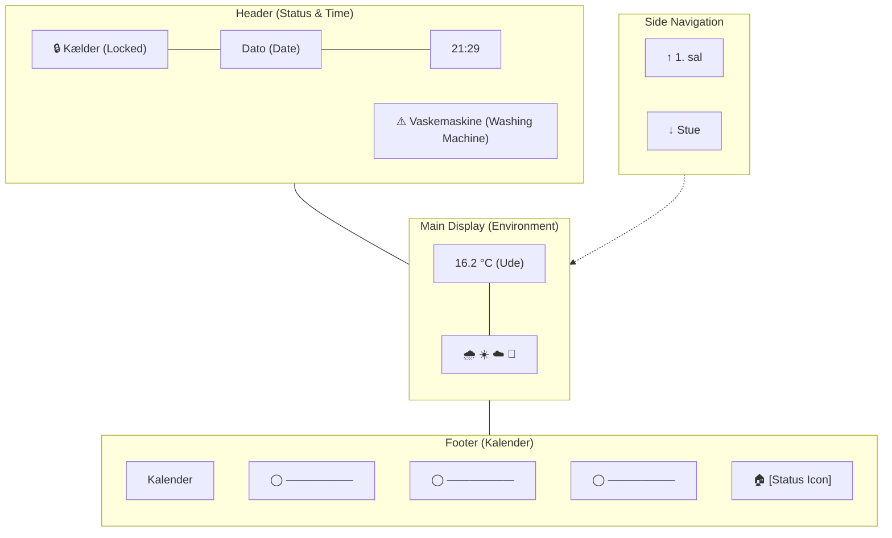

The below is a mermaid diagram of how I wish the layout to be laid out on the main screen of the m5.

```mermaid
graph TD
    subgraph Header ["Header (Status & Time)"]
        direction LR
        L["🔒 Kælder (Locked)"] --- D["Dato (Date)"] --- T["21:29"]
        W["⚠️ Vaskemaskine (Washing Machine)"]
    end

    subgraph Environment ["Main Display (Environment)"]
        direction TB
        Temp["16.2 °C (Ude)"]
        Icons["🌧️ ☀️ ☁️ 🌙"]
        Temp --- Icons
    end

    subgraph Navigation ["Side Navigation"]
        N1["↑ 1. sal"]
        N2["↓ Stue"]
    end

    subgraph Footer ["Footer (Kalender)"]
        direction TB
        K["Kalender"]
        E1["◯ ——————"]
        E2["◯ ——————"]
        E3["◯ ——————"]
        Home["🏠 [Status Icon]"]
    end

    Header --- Environment
    Environment --- Footer
    Navigation -.-> Environment
```