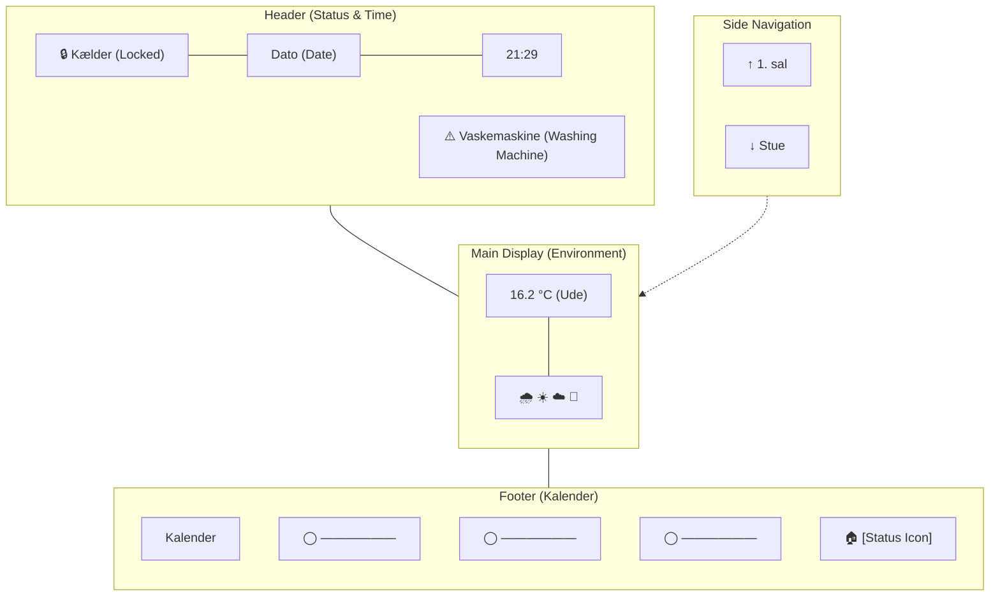

I want a header row with latest hass status updates in the upper left hand corner. DAte and time in the uppr right hand corner.

I want the main display to be the outdoor weather forecast and current temperature. 

the side rocker button should allow me to change diplay to specific pages for rooms: Stuen, 1st Sal displsay the inside temperature in the rooms. 

What do you need from my hass for us to configure this? 

The below is a mermaid diagram of how I wish the layout to be laid out on the main screen of the m5.

